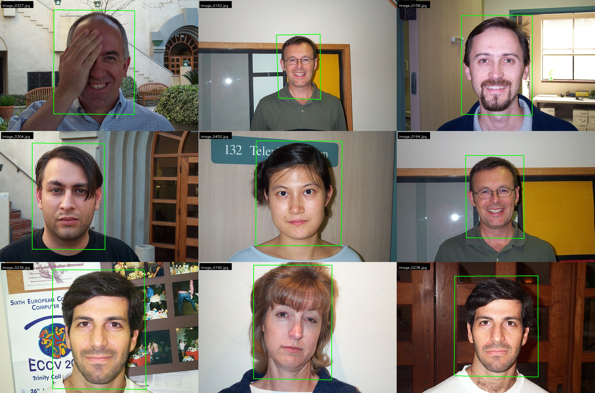

# bin70

A new repository for my learning journey of **BIN7 project** --- a face recognition project.

> **bin7** means face (面, *bīn*) in Taigi.

## 2024-12-02

- [x] [`haar_cascades_cli.py`](./face_detection/haar_cascades/haar_cascades_cli.py) — a CLI for face detection using Haar Cascades
- [x] [`haar_cascades_webcam.py`](./face_detection/haar_cascades/haar_cascades_webcam.py) — a webcam demo for face detection using Haar Cascades
- [x] [`haar_cascades_demo.py`](./face_detection/haar_cascades/haar_cascades_demo.py) — a demo of face detection using Haar Cascades using images in the gallery
- [ ] [`WIDER_FACE_with_MTCNN.ipynb`](./face_detection/mtcnn/WIDER_FACE_with_MTCNN.ipynb) — a notebook for face detection using MTCNN on WIDER FACE dataset

## 2024-12-03

- [x] [`MTCNN_cli.py`](./face_detection/mtcnn/MTCNN_cli.py) — a CLI for face detection using MTCNN
- [x] [`SSD_webcam.py`](./face_detection/ssd/SSD_webcam.py) — a webcam demo for face detection using Res10 SSD
- [x] [`HOG_SVM_webcam.py`](./face_detection/hog_svm/HOG_SVM_webcam.py) — a webcam demo for face detection using HOG + SVM

## 2024-12-04

- [x] [`caltech_1999_manager.py`](./datasets/caltech_1999/caltech_1999_manager.py) — a script for managing the Caltech Face Dataset 1999, including downloading, extracting, and organizing the dataset, and visualizing face images with bounding boxes
- [x] [`face_roi_extractor.py`](./face_recognition/face_roi_extractor.py) — a script for extracting face ROIs from images
- [x] [`eigenfaces.py`](./face_recognition/eigenfaces.py) — a script for face recognition using Eigenfaces
- [x] [`lbp.py`](./face_recognition/lbp.py) — a script for face recognition using Local Binary Patterns

